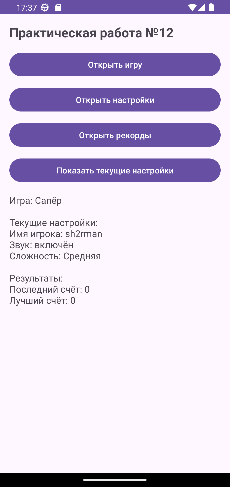
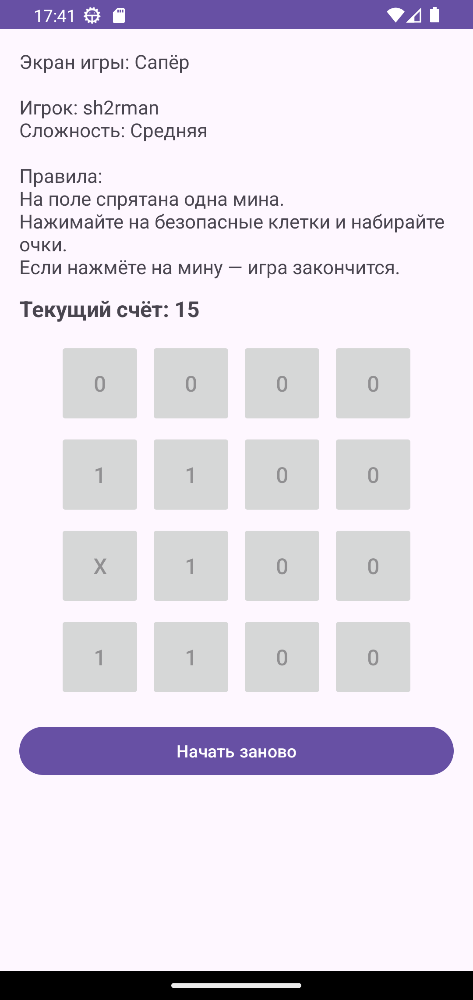
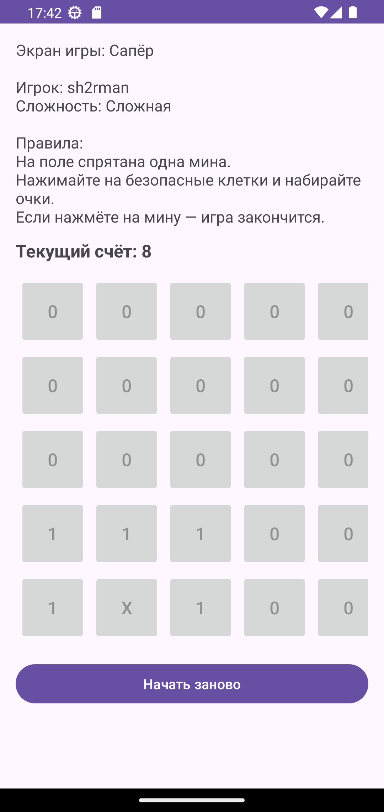

<div align="center">

# Отчет

</div>

<div align="center">

## Практическая работа №12

</div>

<div align="center">

## Типы активностей. Шаблоны Android Studio. Сохранение настроек с SharedPreferences

</div>

**Выполнил:**
Майстренко Константин Александрович
**Группа:** инс-б-о-24-2

---

### Цель работы

Изучить различные типы шаблонов активностей, предоставляемых Android Studio.
Научиться создавать многоэкранные приложения с использованием разных видов окон.
Освоить механизм сохранения простых пользовательских настроек с помощью `SharedPreferences`.

### Ход работы

В ходе выполнения практической работы было создано многоэкранное Android-приложение, в котором использовались различные типы активностей и механизм сохранения пользовательских настроек.

Сначала был создан основной проект приложения. После этого в проект были добавлены дополнительные активности в соответствии с выбранным вариантом задания. Для создания экранов использовались шаблоны Android Studio, такие как `Empty Activity` и `Settings Activity`. Это позволило быстро сформировать структуру приложения и подготовить необходимые экраны.

Далее была реализована навигация между окнами приложения. На главном экране были размещены кнопки перехода к другим активностям, а сами переходы осуществлялись с использованием объектов `Intent`. Благодаря этому пользователь мог открывать экран игры, экран настроек и другие предусмотренные вариантом окна приложения.

Затем была выполнена работа с `SharedPreferences`. На экране настроек были добавлены параметры, которые сохранялись между запусками приложения. В качестве настроек могли использоваться имя игрока, включение или отключение звука, выбор сложности и другие простые параметры. После сохранения значения считывались на главном экране и отображались пользователю в удобном виде.

Также в рамках работы был реализован экран настроек с использованием шаблона `Settings Activity`. Элементы настроек описывались в XML-файле preferences, а сохранение значений происходило автоматически через `SharedPreferences`.

Таким образом, в приложении были объединены основные возможности, изучаемые в данной работе: использование разных типов активностей, организация навигации между окнами и сохранение пользовательских параметров с помощью `SharedPreferences`.

Ниже приведены скриншоты выполнения работы.

<div align="center">


*Рисунок 1. Главный экран приложения*

</div>

<div align="center">


*Рисунок 2. Экран настроек, созданный с использованием шаблона Settings Activity*

</div>

<div align="center">


*Рисунок 3. Игра*

</div>

<div align="center">


*Рисунок 4. Экран рекордов*

</div>

<div align="center">


*Рисунок 5. другой режим сложности игры*

</div>

### Вывод

В результате выполнения практической работы были изучены основные шаблоны активностей Android Studio и способы их применения при создании многоэкранных приложений.
Я научился создавать несколько экранов приложения, настраивать переходы между ними с помощью `Intent`, а также сохранять и считывать пользовательские настройки через `SharedPreferences`.
Практическая работа позволила лучше понять принципы организации структуры Android-приложения и хранения простых пользовательских данных между сеансами работы.

### Ответы на контрольные вопросы

1. **Какие шаблоны активностей предоставляет Android Studio? Кратко опишите назначение 3-4 из них.**
   Android Studio предоставляет несколько готовых шаблонов активностей:

   * `Empty Activity` — пустая активность с минимальной структурой, подходит для ручной разработки интерфейса;
   * `Basic Activity` — активность с верхней панелью `Toolbar`, меню и `FloatingActionButton`;
   * `Settings Activity` — экран настроек, использующий `PreferenceFragmentCompat` и `SharedPreferences`;
   * `Bottom Navigation Activity` — активность с нижней панелью навигации между разделами;
   * `Navigation Drawer Activity` — активность с боковым выдвижным меню.
     Эти шаблоны ускоряют разработку и позволяют использовать готовые стандартные решения.

2. **Для чего используется SharedPreferences? Какие типы данных можно в нём хранить?**
   `SharedPreferences` используется для хранения небольших объёмов данных в формате «ключ-значение».
   Обычно он применяется для настроек приложения, имени пользователя, простых флагов состояния и других небольших параметров.
   В нём можно хранить:

   * `String`
   * `int`
   * `boolean`
   * `float`
   * `long`
   * `Set<String>`

3. **В чём разница между методами getPreferences(), getSharedPreferences() и PreferenceManager.getDefaultSharedPreferences()?**

   * `getPreferences()` возвращает настройки, связанные только с одной конкретной активностью;
   * `getSharedPreferences()` используется для получения именованного файла настроек, доступного во всём приложении;
   * `PreferenceManager.getDefaultSharedPreferences()` возвращает стандартный файл настроек приложения, который часто используется вместе с `Settings Activity`.
     То есть различие заключается в области применения и способе получения файла настроек.

4. **Как записать данные в SharedPreferences? Объясните разницу между apply() и commit().**
   Для записи данных нужно получить объект `Editor`, положить в него значения и завершить запись:

   ```java
   SharedPreferences prefs = getSharedPreferences("MyPrefs", MODE_PRIVATE);
   SharedPreferences.Editor editor = prefs.edit();
   editor.putString("player_name", "Константин");
   editor.putBoolean("sound_enabled", true);
   editor.apply();
   ```

   Разница:

   * `apply()` сохраняет данные асинхронно и не возвращает результат;
   * `commit()` сохраняет данные синхронно и возвращает `boolean`, показывающий, успешно ли выполнена запись.
     В большинстве случаев удобнее использовать `apply()`.

5. **Как прочитать данные из SharedPreferences? Для чего нужно значение по умолчанию?**
   Для чтения используется объект `SharedPreferences` и методы `getString()`, `getBoolean()` и другие:

   ```java
   String name = prefs.getString("player_name", "Не указано");
   boolean sound = prefs.getBoolean("sound_enabled", true);
   ```

   Значение по умолчанию нужно на случай, если по указанному ключу данных ещё нет. Тогда приложение не получит ошибку, а вернёт заранее заданное резервное значение.

6. **Как создать экран настроек с использованием шаблона Settings Activity? Где описываются элементы настроек?**
   Экран настроек создаётся через меню Android Studio:
   `New → Activity → Settings Activity`.
   После этого Android Studio автоматически создаёт класс активности, фрагмент настроек и XML-файл с описанием самих параметров.
   Элементы настроек обычно описываются в XML-файле в папке `res/xml/`, например `root_preferences.xml`.

7. **Как организовать переход между активностями с помощью Intent?**
   Для перехода создаётся объект `Intent`, в котором указывается текущий контекст и класс целевой активности:

   ```java
   Intent intent = new Intent(MainActivity.this, SettingsActivity.class);
   startActivity(intent);
   ```

   После вызова `startActivity()` открывается новая активность.

8. **Что такое FloatingActionButton и в каких шаблонах он присутствует?**
   `FloatingActionButton` — это круглая кнопка действия, которая обычно размещается поверх интерфейса в правом нижнем углу экрана.
   Она используется для быстрого выполнения главного действия на текущем экране.
   Чаще всего она присутствует в шаблоне `Basic Activity`.

### Список литературы

1. Phillips, B., Stewart, K., & Marsicano, K. *Android Programming: The Big Nerd Ranch Guide* (5th Edition). Big Nerd Ranch Guides, 2022.
2. Документация Android Developers. Руководство по работе с `SharedPreferences`.
3. Документация Android Developers. Руководство по активностям и навигации.
4. Гриффитс Д., Гриффитс Д. *Head First. Программирование для Android*. Питер, 2021.
5. Соколова В. В. *Разработка мобильных приложений на платформе Android*. М.: Юрайт, 2021.
